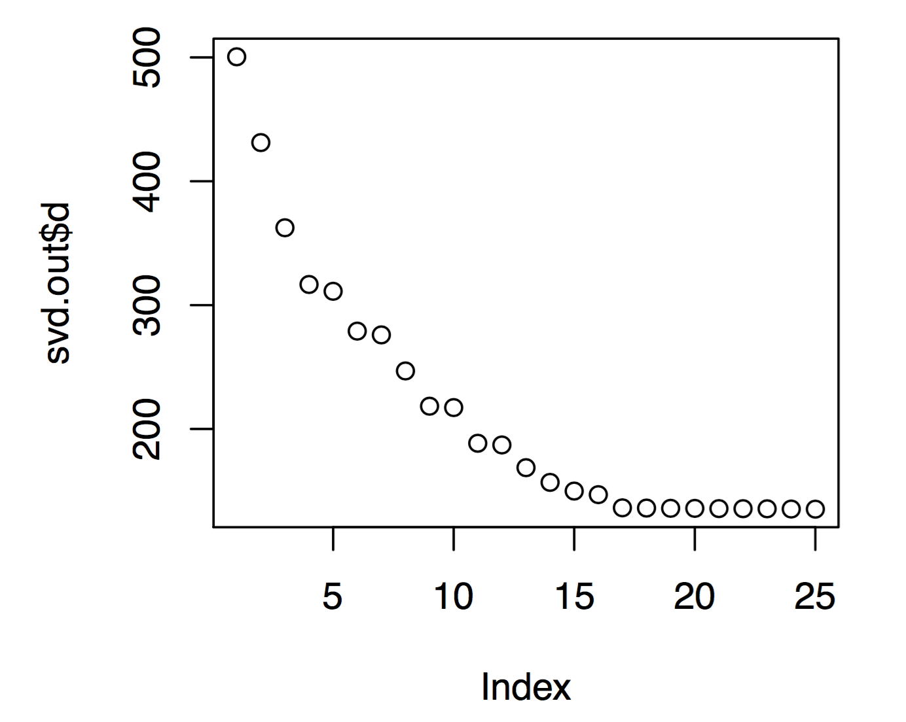
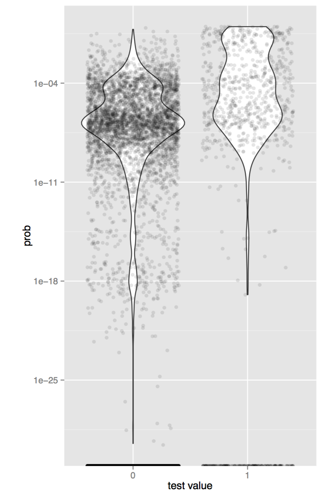

# Reading in data

	library(data.table)
	trips = read.table("txTripletsCounts.txt", nrows=3348026)
	DT.trips = data.table(trips[seq(1,length(trips), 3)], trips[seq(2,length(trips)
	setnames(DT.trips, c("giver", "receiver", "N"))
	setkey(DT.trips, "giver", "receiver")
#	
	DT.trips
	##           giver  receiver  N
	##       1:      0         1  3
	##       2:      0        13  1
	##       3:      0        37  1
	##       4:      0        51  1
	##       5:      0    438481  1
	##      ---
	## 3348022: 444070    435075  1
	## 3348023: 444071     62271  1
	## 3348024: 444072    356856  1
	## 3348025: 444073     26841  1
	## 3348026: 444074    411870  1
	
# Turning data into binary data

	DT.binary = DT.trips[,1,by=c("giver","receiver")]
	setnames(DT.binary, c("giver", "receiver", "indicator"))
	setkey(DT.binary, "giver", "receiver")
#	
	DT.binary
	##           giver receiver indicator
	##       1:      0        1         1
	##       2:      0       13         1
	##       3:      0       37         1
	##       4:      0       51         1
	##       5:      0   438481         1
	##      ---
	## 3348022: 444070   435075         1
	## 3348023: 444071    62271         1
	## 3348024: 444072   356856         1
	## 3348025: 444073    26841         1
	## 3348026: 444074   411870         1
	
# Using sparse matrices

	UNIQUE = sort(unique(c(DT.binary[,giver], DT.binary[,receiver])))
	NUM.ADDR = length(UNIQUE)
	library(Matrix)
	MAT.bin = spMatrix(NUM.ADDR, NUM.ADDR, i=DT.binary[,giver]+1, j=DT.binary[,receiver]+1, x=DT.binary[,indicator])

# Reading in the test data

	test.data = read.table("testTriplets.txt")
	test.data[,1] = test.data[,1] + 1
	test.data[,2] = test.data[,2] + 1
	test.data = data.table(test.data)
	setnames(test.data, c("giver", "receiver", "bool"))
#
	test.data
	##         giver receiver bool
	##     1:      2       17    0
	##     2:      2       67    0
	##     3:      2    12459    0
	##     4:      2    22507    1
	##     5:      2    29177    0
	##    ---
	##  9996: 443158
	##  9997: 443158
	##  9998: 443158
	##  9999: 443158   295411    0
	## 10000: 443158   381757    0

# Look at eigenvalues
	set.seed(1234)
	library(irlba)
	svd.out=irlba(MAT.bin, 25, 25, tol=1e-10)
	plot(svd.out$d)

  

# Do SVD
	set.seed(1234)
	library(irlba)
	svd.out=irlba(MAT.bin, 11, 11, tol=1e-10)
	
# Get results
	u = svd.out$u
	v = svd.out$v
	d = svd.out$d
	prob = rep(0, nrow(test.data))
	for(i in 1:nrow(test.data)){
  	p = sum(u[test.data[i,giver],]*d*v[test.data[i,receiver],])
  	    if(p < 0) p = 0
  	    if(p > 1) p = 1
  	    prob[i] = p
	}
	
	library(ggplot2)
	dat = data.frame(prob, as.factor(test.data[,bool]))
	colnames(dat) = c("prob", "value")
	ggplot(dat, aes(value, prob)) +
    	    geom_violin() +
    	    geom_jitter(alpha=0.1) +
	    scale_y_log10() +
	    labs(x="test value", y="prob")

  

